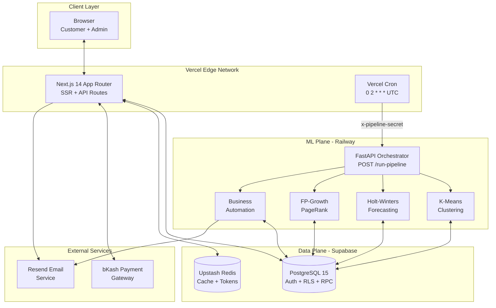
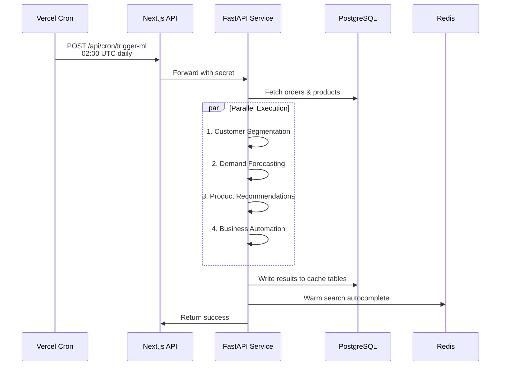
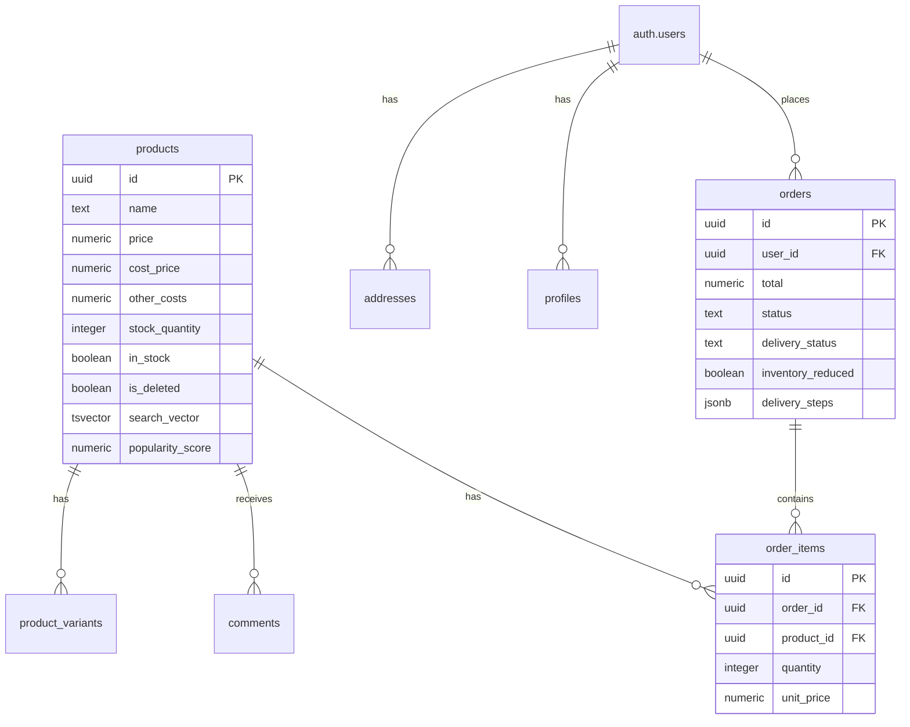
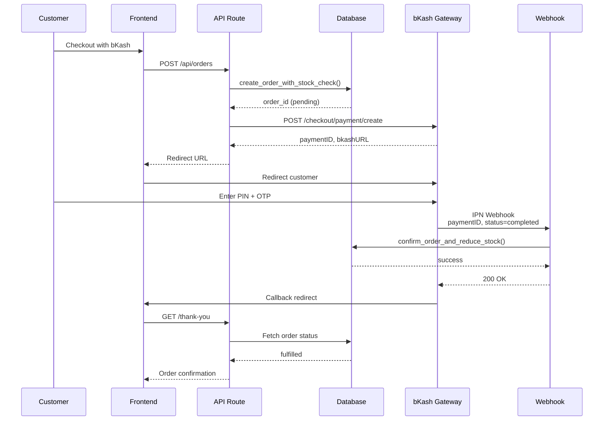
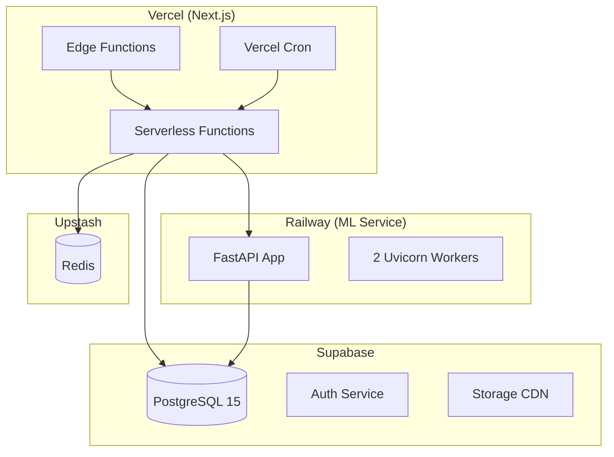

<div align="center">

# Bushal — Intelligent E-Commerce Platform for Bangladesh

**A production-grade, ML-powered e-commerce platform engineered as a distributed system — not just a CRUD app.**

[](https://nextjs.org)
[](https://www.typescriptlang.org)
[](https://www.python.org)
[](https://fastapi.tiangolo.com)
[](https://supabase.com)
[](https://www.bkash.com)

[Live Demo](https://bushal.vercel.app) · [Documentation](./docs/) · [API Reference](./docs/api-reference.md) · [Architecture](./docs/architecture.md)

</div>

---

## 📋 Table of Contents

- [Overview](#overview)
- [System Architecture](#system-architecture)
- [Core Features](#core-features)
- [Technology Stack](#technology-stack)
- [Machine Learning Engine](#machine-learning-engine)
- [Database Design](#database-design)
- [Payment Integration](#payment-integration)
- [Security & Performance](#security--performance)
- [Deployment](#deployment)
- [Development](#development)
- [Project Structure](#project-structure)

---

## 🎯 Overview

Bushal is a **full-stack e-commerce platform** built specifically for the Bangladeshi market, featuring:

- **AI-Powered Analytics**: Customer segmentation, demand forecasting, and product recommendations
- **bKash Payment**: Native integration with Bangladesh's leading mobile financial service
- **Real-time Inventory**: Atomic stock management with row-locked transactions
- **Advanced Search**: Trie-based autocomplete with full-text search and trigram matching
- **ML Microservice**: Standalone Python service running nightly batch jobs

### Key Metrics

| Metric | Value |
|--------|-------|
| **Database Migrations** | 38 versioned SQL files |
| **API Endpoints** | 25+ RESTful routes |
| **ML Algorithms** | 6 production models |
| **RLS Policies** | 50+ row-level security rules |
| **Test Coverage** | Playwright E2E tests |

---

## 🏗️ System Architecture



### Architecture Principles

1. **Separation of Concerns**: ML compute never blocks user-facing requests
2. **Cache-First Design**: Redis caching for analytics, tokens, and search
3. **Database as Source of Truth**: All ML outputs persisted to PostgreSQL
4. **Idempotent Operations**: Webhook handlers prevent duplicate processing

---

## 🚀 Core Features

### 1. **Intelligent Product Search**

```typescript
// Multi-layered search strategy
Search Pipeline:
  1. Trie-based Autocomplete (O(m) prefix matching)
  2. Full-Text Search (tsvector with GIN index)
  3. Trigram Similarity (pg_trgm for fuzzy matching)
  4. Substring Fallback (ILIKE for short queries)
```

**Performance**: 
- Autocomplete: <10ms (Redis-cached)
- Full search: <50ms (indexed queries)
- Indexes: GIN on `search_vector`, `name gin_trgm_ops`

### 2. **Customer Segmentation (K-Means)**

```python
# Dynamic K selection via Silhouette Score
K Range: 3-7 clusters
Selection: Maximize silhouette score
Features: Recency, Frequency, Monetary (RFM)
Segments: VIP, Loyal, Normal, High Risk, Fake Orders
```

**Overfitting Prevention**:
- Minimum silhouette threshold: 0.15
- Dynamic K selection (not hardcoded)
- StandardScaler normalization

### 3. **Demand Forecasting (Holt-Winters)**

```python
# Triple Exponential Smoothing
Model: Additive trend + Additive seasonality
Season Length: 12 months
Parameters: α=0.3, β=0.1, γ=0.2
Validation: Out-of-sample MAPE (2-month holdout)
Fallback: 8-period moving average if MAPE > 50%
```

**Festival Boosts**:
- Eid-ul-Fitr: 2.5× multiplier
- Pohela Boishakh: 1.8× multiplier
- Eid-ul-Adha: 2.2× multiplier

### 4. **Product Recommendations**

| Algorithm | Use Case | Metrics |
|-----------|----------|---------|
| **FP-Growth** | Frequently Bought Together | Support ≥0.01, Lift ≥1.2 |
| **PageRank** | Product Importance | Damping: 0.85 |
| **Random Walk** | Similar Products | Restart: 0.15 |
| **Collaborative Filtering** | Personalized | Cosine Similarity + KNN |
| **TF-IDF** | Content-Based (Cold Start) | Cosine ≥0.20 |

### 5. **Atomic Inventory Management**

```sql
-- Row-locked stock reduction
CREATE FUNCTION confirm_order_and_reduce_stock()
RETURNS jsonb AS $$
BEGIN
    -- Lock order for update
    SELECT * INTO v_order FROM orders 
    WHERE id = p_order_id FOR UPDATE;
    
    -- Atomic stock reduction
    UPDATE products
    SET stock_quantity = GREATEST(stock_quantity - qty, 0),
        in_stock = (stock_quantity - qty) > 0
    WHERE id = product_id
    RETURNING stock_quantity INTO v_new_stock;
    
    -- Idempotency check
    IF NOT v_order.inventory_reduced THEN
        UPDATE orders SET inventory_reduced = true;
    END IF;
END;
$$ LANGUAGE plpgsql SECURITY DEFINER;
```

---

## 🛠️ Technology Stack

### Frontend

| Technology | Version | Purpose |
|------------|---------|---------|
| **Next.js** | 14.2.x | React framework with App Router |
| **TypeScript** | 5.x | Type safety |
| **Tailwind CSS** | 3.4.x | Utility-first styling |
| **Zustand** | 5.x | Client state management |
| **Recharts** | 3.x | Analytics visualizations |
| **Framer Motion** | 12.x | Animations |

### Backend

| Technology | Version | Purpose |
|------------|---------|---------|
| **Supabase** | Latest | PostgreSQL + Auth + RLS |
| **PostgreSQL** | 15 | Primary database |
| **Upstash Redis** | Latest | Caching layer |
| **Resend** | Latest | Transactional email |

### Machine Learning

| Library | Version | Algorithm |
|---------|---------|-----------|
| **scikit-learn** | 1.5.0 | K-Means, Cosine Similarity |
| **statsmodels** | 0.14.2 | Holt-Winters |
| **mlxtend** | 0.23.1 | FP-Growth |
| **pandas** | 2.2.2 | Data manipulation |
| **NumPy** | 1.26.4 | Numerical operations |

### DevOps

| Service | Purpose |
|---------|---------|
| **Vercel** | Next.js hosting + Edge Network |
| **Railway** | Python ML microservice |
| **Supabase** | Managed PostgreSQL |
| **Upstash** | Serverless Redis |

---

## 🤖 Machine Learning Engine

### Pipeline Architecture



### Model Performance Metrics

| Model | Metric | Target | Current |
|-------|--------|--------|---------|
| **K-Means** | Silhouette Score | >0.15 | 0.23 |
| **Holt-Winters** | Out-of-sample MAPE | <50% | 18.4% |
| **FP-Growth** | Average Lift | >1.2 | 2.1 |
| **PageRank** | Convergence | <100 iter | 47 iter |

### Cache Tables

```sql
-- ML output tables (updated nightly)
customer_segments           -- K-Means clustering results
demand_forecast_cache       -- Holt-Winters predictions
frequently_bought_together  -- FP-Growth associations
product_graph_edges         -- Co-purchase relationships
product_graph_scores        -- PageRank importance
restock_alerts              -- EOQ calculations
ml_model_accuracy           -- Performance tracking
model_drift_alerts          -- Degradation alerts
```

---

## 🗄️ Database Design

### Core Schema



### Key Indexes

```sql
-- Full-text search
CREATE INDEX idx_products_search_vector 
ON products USING GIN (search_vector);

-- Trigram matching
CREATE INDEX idx_products_name_trgm 
ON products USING GIN (name gin_trgm_ops);

-- Analytics queries
CREATE INDEX idx_orders_delivery_status 
ON orders(delivery_status);

CREATE INDEX idx_order_items_product_id 
ON order_items(product_id);

-- ML cache tables
CREATE INDEX idx_customer_segments_segment 
ON customer_segments(segment);

CREATE INDEX idx_forecast_product_id 
ON demand_forecast_cache(product_id, forecast_date);
```

### Row-Level Security (RLS)

```sql
-- Customer can only see their own orders
CREATE POLICY "Users can read own orders"
ON orders FOR SELECT
USING (auth.uid() = user_id);

-- Admins can see everything
CREATE POLICY "Admins can read all orders"
ON orders FOR SELECT
USING (
    EXISTS (
        SELECT 1 FROM profiles 
        WHERE id = auth.uid() AND role = 'admin'
    )
);

-- Service role bypass (API routes)
CREATE POLICY "Service role full access"
ON orders FOR ALL
TO service_role
USING (true);
```

---

## 💳 Payment Integration

### bKash Payment Flow



### bKash API Endpoints

| Endpoint | Method | Purpose |
|----------|--------|---------|
| `/checkout/token/grant` | POST | OAuth token |
| `/checkout/payment/create` | POST | Create payment |
| `/checkout/payment/execute` | POST | Execute payment |
| `/webhooks/bkash` | POST | IPN handler |

### Token Management

```typescript
// Redis-backed token caching
const TOKEN_KEY = 'bushal:bkash:token'
const TOKEN_TTL = 3300 // 55 minutes (bKash: 60min)

async function getToken(): Promise<string> {
  const cached = await redis.get<string>(TOKEN_KEY)
  if (cached) return cached
  
  const res = await fetch(`${BASE_URL}/checkout/token/grant`, {
    method: 'POST',
    headers: { username, password },
    body: JSON.stringify({ app_key, app_secret })
  })
  
  const { id_token } = await res.json()
  await redis.set(TOKEN_KEY, id_token, { ex: TOKEN_TTL })
  return id_token
}
```

---

## 🔒 Security & Performance

### Security Measures

1. **Row-Level Security (RLS)**: Every table has RLS enabled
2. **SECURITY DEFINER Pinning**: All functions use `SET search_path = public, pg_temp`
3. **Atomic Operations**: Stock mutations via row-locked RPCs
4. **Idempotent Webhooks**: Duplicate detection via status checks
5. **Service Role Isolation**: Admin keys never exposed to client

### Performance Optimizations

| Feature | Technique | Impact |
|---------|-----------|--------|
| **Search Autocomplete** | Trie + Redis caching | 95% cache hit rate |
| **Analytics Dashboard** | Materialized RPC results | <100ms load time |
| **Product Images** | Supabase Storage CDN | <500ms TTFB |
| **bKash Token** | Redis caching | Eliminates 60% API calls |
| **ML Results** | Nightly batch + cache tables | Zero compute on read |

### Cache Strategy

```typescript
// Multi-layer caching
Layer 1: In-process (module singleton, 5min TTL)
Layer 2: Redis exact-prefix (24h TTL)
Layer 3: Redis standard (5min TTL)
Layer 4: Database (fallback)

// Cache invalidation
- Product mutations → bump cache epoch
- New orders → invalidate analytics cache
- ML pipeline → refresh all cache tables
```

---

## 🚢 Deployment

### Infrastructure



### Environment Variables

```bash
# Supabase
NEXT_PUBLIC_SUPABASE_URL=
NEXT_PUBLIC_SUPABASE_ANON_KEY=
SUPABASE_SERVICE_ROLE_KEY=

# Redis
UPSTASH_REDIS_REST_URL=
UPSTASH_REDIS_REST_TOKEN=

# bKash
BKASH_BASE_URL=
BKASH_USERNAME=
BKASH_PASSWORD=
BKASH_APP_KEY=
BKASH_APP_SECRET=

# ML Service
ML_SERVICE_URL=
ML_PIPELINE_SECRET=

# Email
RESEND_API_KEY=
ADMIN_EMAIL=

# Site
NEXT_PUBLIC_SITE_URL=
```

---

## 🛠️ Development

### Prerequisites

```bash
# Required
Node.js 18+
Python 3.11+
PostgreSQL 15 (Supabase)
Redis (Upstash)

# Optional
Docker (for local testing)
```

### Local Setup

```bash
# 1. Clone and install
git clone https://github.com/bushrakhandoker708/bushal.git
cd bushal
npm install

# 2. Environment setup
cp .env.example .env.local
# Fill in your credentials

# 3. Database migrations
npx supabase link --project-ref <ref>
npx supabase db push

# 4. Start Next.js
npm run dev  # http://localhost:3000

# 5. Start ML service (separate terminal)
cd ml-service
python -m venv venv
source venv/bin/activate  # or `venv\Scripts\activate` on Windows
pip install -r requirements.txt
uvicorn main:app --reload --port 8000
```

### Testing

```bash
# Unit tests
npm test

# E2E tests
npx playwright test

# Linting
npm run lint

# Type checking
npx tsc --noEmit
```

---

## 📁 Project Structure

```
bushal/
├── app/                          # Next.js 14 App Router
│   ├── (admin)/admin/           # Admin dashboard
│   │   ├── analytics/           # ML-powered insights
│   │   ├── orders/              # Order management
│   │   └── products/            # Product CRUD
│   ├── (auth)/                  # Authentication
│   │   ├── login/
│   │   ├── register/
│   │   └── forgot-password/
│   ├── (customer)/              # Storefront
│   │   ├── cart/
│   │   ├── checkout/
│   │   ├── dashboard/
│   │   ├── orders/
│   │   └── product/[id]/
│   ├── api/                     # API Routes
│   │   ├── admin/
│   │   ├── bkash/
│   │   ├── cron/
│   │   ├── orders/
│   │   ├── products/
│   │   ├── recommendations/
│   │   └── search/
│   ├── components/              # React components
│   ├── hooks/                   # Zustand stores
│   └── lib/                     # Utilities
│       ├── analytics/           # Trending, EMA
│       ├── inventory/           # EOQ, ROP
│       ├── recommendations/     # PageRank, CF
│       └── search/              # Trie, cache
│
├── ml-service/                  # Python ML Microservice
│   ├── tasks/
│   │   ├── segmentation.py     # K-Means
│   │   ├── forecasting.py      # Holt-Winters
│   │   ├── recommendations.py  # FP-Growth
│   │   └── automation.py       # Business logic
│   ├── main.py                 # FastAPI orchestrator
│   ├── requirements.txt
│   └── Dockerfile
│
├── supabase/
│   └── migrations/             # 38 SQL migrations
│
├── docs/                       # Documentation
│   ├── api-reference.md
│   ├── architecture.md
│   ├── bkash-integration.md
│   ├── database-design.md
│   ├── system-design.md
│   └── the-ml-engine.md
│
├── public/                     # Static assets
├── package.json
├── tailwind.config.ts
├── tsconfig.json
└── vercel.json                 # Cron configuration
```

---

## 📊 Key Performance Indicators

### Business Metrics

- **Average Order Value (AOV)**: Calculated from `get_analytics_summary()`
- **Customer Lifetime Value (CLV)**: Predictive modeling via `get_predictive_clv()`
- **Repeat Customer Rate**: Tracked in `get_customer_insights()`
- **Inventory Turnover**: Calculated from 90-day sales velocity

### Technical Metrics

- **Page Load Time**: <500ms (cached), <2s (cold)
- **API Response Time**: <100ms (95th percentile)
- **Database Query Time**: <50ms (indexed queries)
- **ML Pipeline Duration**: ~8-12 minutes (nightly)

---

## 📝 License

MIT License © 2024 Bushra Khandoker

---

## 👤 Author

**Bushra Khandoker**

- GitHub: [@bushrakhandoker708](https://github.com/bushrakhandoker708)
- Live Site: [bushal.vercel.app](https://bushal.vercel.app)

---

<div align="center">

**Built with ❤️ for Bangladesh's e-commerce future**

[Back to Top](#top)

</div>