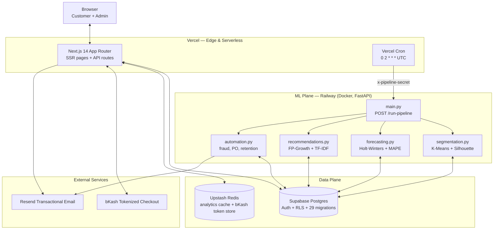
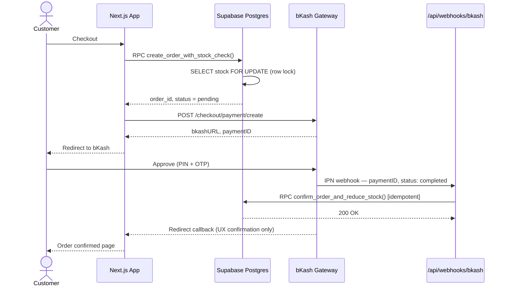
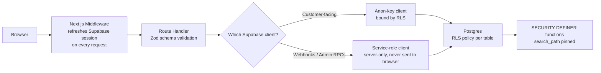

<div align="center">

# Bushal

**A premium e-commerce platform for Bangladesh, engineered like a distributed system — not a CRUD app.**

Next.js storefront and admin console · Supabase Postgres with row-level security · a standalone Python ML microservice that runs K-Means, Holt-Winters, and FP-Growth on a daily cron · bKash as the payment rail, because Stripe was never going to clear a Bangladeshi bank account.

[](https://nextjs.org)
[](https://www.typescriptlang.org)
[](https://www.python.org)
[](https://fastapi.tiangolo.com)
[](https://supabase.com)
[](https://scikit-learn.org)
[](https://upstash.com)
[](https://railway.app)
[](https://vercel.com)
[](https://www.bkash.com)
[](#license)

[Live Site](https://bushal.vercel.app) · [Architecture](docs/architecture.md) · [System Design](docs/system-design.md) · [Database](docs/database-design.md) · [ML Engine](docs/the-ml-engine.md) · [bKash Integration](docs/bkash-integration.md) · [API Reference](docs/api-reference.md)

</div>

---

## Table of Contents

1. [What This Is](#what-this-is)
2. [Why It Exists](#why-it-exists)
3. [System Architecture](#system-architecture)
4. [Tech Stack](#tech-stack)
5. [Engineering Decision Log](#engineering-decision-log)
6. [The ML Engine, In Brief](#the-ml-engine-in-brief)
7. [The Recommendation Stack](#the-recommendation-stack)
8. [Payment Flow: Checkout to Fulfillment](#payment-flow-checkout-to-fulfillment)
9. [Data Model & Indexing](#data-model--indexing)
10. [Repository Layout](#repository-layout)
11. [Design System](#design-system)
12. [Security Posture](#security-posture)
13. [Monitoring & Observability](#monitoring--observability)
14. [Local Development](#local-development)
15. [Deployment Topology](#deployment-topology)
16. [What I'd Do Differently](#what-id-do-differently)
17. [Documentation Index](#documentation-index)
18. [Roadmap](#roadmap)
19. [Author & License](#author--license)

---

## What This Is

Bushal is a full-stack e-commerce platform — storefront, checkout, admin dashboard, and a self-contained machine learning layer — built end-to-end by one person, for the Bangladeshi market specifically rather than as a generic storefront template with the currency symbol swapped.

It is not a tutorial project. The codebase contains row-level-security policies that were rewritten after a real privilege-escalation pattern was found in `SECURITY DEFINER` functions, an atomic stock-reservation RPC that exists because two customers in different tabs could otherwise oversell the same unit of inventory, and a customer-segmentation pipeline that moved from a hardcoded `K=5` to a Silhouette-Score-optimized K because hardcoding a cluster count for a business you've never measured is a guess dressed up as a feature.

Every major subsystem below has a "first version → why it broke → what replaced it" story, because that's actually how the system was built — and every claim in this document traces back to a specific file or migration in this repository, not to a number that sounded good.

## Why It Exists

Bangladesh's e-commerce layer is dominated by either thin storefront builders with no analytics, or marketplaces that take a cut and own the customer relationship. Bushal was built to answer a narrower question: **what does an independently-owned, premium storefront look like if it's run with the same operational discipline as a much larger company — demand forecasting, customer lifetime value modeling, fraud detection, automated purchase orders — without the headcount?**

The answer turned out to require treating "ML for e-commerce" as a *systems* problem, not a notebook problem: where the heavy computation lives, how it's triggered, how its outputs get cached, and how a non-technical store owner sees the result as a number on a dashboard instead of a Jupyter cell.

## System Architecture

The platform is split into two independently deployable planes that communicate over HTTPS and share one source of truth — Postgres. The web application never blocks on machine learning, and the ML service never serves a customer-facing request.



Two design choices carry the whole diagram:

- **The ML plane reads and writes the same Postgres instance the web app uses, but never sits in the request path.** Every ML output — customer segments, demand forecasts, FBT rules, PageRank scores — lands in a cache table. The dashboard does a `SELECT`, not a computation, so loading `/admin/analytics` never depends on whether scikit-learn finished running.
- **Redis is a single piece of infrastructure doing two unrelated jobs** — caching expensive analytics RPCs *and* holding the bKash OAuth token — because both problems are instances of the same failure mode (see [Engineering Decision Log](#engineering-decision-log)).

## Tech Stack

| Layer | Choice | Why |
|---|---|---|
| Frontend framework | Next.js 14 (App Router) | Server Components for data-heavy admin pages, route handlers for the API, one deploy target |
| Language | TypeScript (web), Python 3.11 (ML) | Type safety on the request path; Python because no JS library matches scikit-learn / statsmodels / mlxtend for this work |
| Database | Supabase (Postgres) | Auth, row-level security, and Postgres in one box — `pg_trgm`, `tsvector`, and window functions all used directly, see below |
| Caching | Upstash Redis (REST-based) | Serverless-compatible — no persistent TCP connection needed from Vercel functions |
| ML runtime | FastAPI + Uvicorn on Railway | A long-running container, not a 10–60s serverless function, for jobs that take minutes |
| ML libraries | scikit-learn, statsmodels, mlxtend, pandas, NumPy | K-Means + silhouette scoring, Holt-Winters exponential smoothing, FP-Growth association mining |
| Payments | bKash Tokenized Checkout | Bangladesh's dominant MFS; see [bKash Integration](docs/bkash-integration.md) |
| Email | Resend | Transactional (order status) + automated retention campaigns from the ML automation task |
| State (client) | Zustand | Cart, wishlist, recently-viewed, compare — persisted client-side, normalized to avoid refetching product snapshots |
| Charts | Recharts | Admin analytics: revenue trends, RFM matrix, cohort heatmap |
| Validation | Zod | Schema validation on product and auth forms |
| Testing | Playwright | E2E test capability for checkout and admin flows (currently run manually — see [What I'd Do Differently](#what-id-do-differently)) |
| Hosting | Vercel (web) + Railway (ML) + Supabase (data) | Three platforms chosen independently per workload, not one vendor for everything |

## Engineering Decision Log

This is the part most READMEs skip. Each entry below is a real fork in the codebase's history — not a hypothetical "we could have used X" — and the rationale is the same one you'd defend in a design review.

### 1. ML compute: in-request TypeScript → a separate Python service on a daily cron

**The problem.** The first version of customer segmentation (`lib/analytics/customerSegmentation.ts`) and "frequently bought together" (`lib/recommendations/frequentlyBoughtTogether.ts`) ran *inside* Next.js API routes, hand-rolled in TypeScript — a K-Means++ implementation with min-max normalization for segmentation, an Apriori implementation with support/confidence/lift scoring for the FBT mining. They worked. The trouble was *where* they ran: a Vercel serverless function has an execution ceiling, and re-clustering the full order history every time an admin opened the analytics tab is exactly the kind of unbounded, traffic-correlated compute that ceiling exists to stop. As order volume grows, the page that's supposed to load instantly becomes the page most likely to time out.

**What I shipped instead.** The heavy jobs moved to a standalone FastAPI service deployed on Railway — a container with no execution-time ceiling, running scikit-learn's optimized (C-backed) `KMeans` and `mlxtend`'s FP-Growth instead of hand-rolled JS. A single Vercel Cron job (`vercel.json`, `0 2 * * *`) hits `/api/cron/trigger-ml`, which forwards a POST to the Python service's `/run-pipeline` endpoint with a shared secret in the header. The Python service runs all four jobs sequentially, catching and logging failures per-job so one broken pipeline doesn't take the others down, and writes results into cache tables (`customer_segments`, `frequently_bought_together`, `demand_forecast_cache`, …). The dashboard now reads a cache row instead of running a model — an O(1) lookup instead of O(n·k·iterations) on every page view.

**The trade-off I accepted.** Segments and forecasts are now at most 24 hours stale. For a business running daily fulfillment cycles, that's the right trade — correctness-on-read at the cost of a bounded staleness window, instead of perfect freshness at the cost of an unbounded request.

### 2. Payments: Stripe → bKash

**The problem.** Stripe's merchant-account model requires the business to be incorporated in one of Stripe's supported countries to receive payouts — and Bangladesh has never been on that list. A storefront built around `@stripe/react-stripe-js` looks correct in development and is structurally unable to pay out the merchant in production. This is a constraint that surfaces *after* integration work is already done, not before, if you start from "Stripe is the default."

**What I shipped instead.** A direct integration with bKash's Tokenized Checkout API (`app/lib/bkash/index.ts`): OAuth-style token grant, `checkout/payment/create`, `checkout/payment/execute`. Because bKash is how the vast majority of Bangladeshi online shoppers already pay, this isn't a compromise — it converts better than a card form most of this user base doesn't have a card to fill in.

**What's left over.** `@stripe/react-stripe-js` and the `stripe_session_id` column on `orders` are still in the codebase as of this writing — a deliberate piece of acknowledged tech debt from the pre-bKash iteration, kept rather than ripped out mid-migration, flagged here instead of hidden.

### 3. bKash token storage: module-level variable → Redis

**The problem.** The first version of `getToken()` cached the OAuth token in a module-level JS variable. That works on a long-running server. It silently breaks on Vercel: every cold start spins up a fresh function instance with its own memory, so the "cache" was invisible across a meaningful fraction of production requests, and each one re-requested a token from bKash that should have lasted 60 minutes.

**What I shipped instead.** The token now lives in Upstash Redis with a 55-minute TTL (`bushal:bkash:token`) — a 5-minute safety buffer under bKash's actual 60-minute expiry. Redis is reachable over REST from any serverless invocation, so the token now actually survives across cold starts instead of only within one.

### 4. Inventory integrity: decrement-on-checkout → row-locked, admin-confirmed decrement

**The problem.** The earliest order-creation logic decremented `stock_quantity` the moment an order was placed. Two customers checking out the last unit at the same time is a textbook race condition — and "the same time" doesn't require malice, just a flash sale.

**What I shipped instead, in two steps.** First, `create_order_with_stock_check` (migration `007`) made stock-checking and order-insertion one atomic Postgres function using `SELECT … FOR UPDATE` — a pessimistic row lock that serializes concurrent checkouts on the same product instead of letting them race. Later (migration `015`), the model changed again: stock is no longer reduced at checkout *at all*. An `inventory_reduced` flag defers the actual decrement until an admin explicitly confirms the order via `confirm_order_and_reduce_stock`, which performs the status update and the stock decrement in one transaction. This matches how a small retailer actually fulfills orders — payment received ≠ stock committed — and removes the failure mode entirely rather than just making it atomic.

The bKash IPN webhook (`app/api/webhooks/bkash/route.ts`) is the production caller of this RPC: it checks `order.status === 'fulfilled' || order.delivery_status === 'confirmed'` before doing anything, so a duplicate webhook delivery — a normal occurrence with any payment provider — is a no-op rather than a double-fulfillment. No separate locking layer is needed because the idempotency check and the state mutation happen against the same row inside the same request.

### 5. Search: Elasticsearch (evaluated) → Postgres full-text search + a hand-rolled Trie

**The problem.** `@elastic/elasticsearch` sits in `package.json` as evidence of the road not taken. Running and operating an Elasticsearch cluster is a real ongoing cost — index management, a second system to keep in sync with Postgres, a second set of credentials and failure modes — and at this catalog's scale, it buys speed Postgres already provides natively.

**What I shipped instead.** Two complementary pieces. For full-text search, `search_vector` is a weighted, generated `tsvector` column (product name at rank `A`, description at rank `B`, with both English and `simple` configurations stacked for partial Bengali-transliteration tolerance), backed by GIN indexes on the vector itself plus `gin_trgm_ops` trigram indexes on `name` and `description` — fuzzy, typo-tolerant matching, all inside the same database transaction as everything else, no second system. For autocomplete specifically, `lib/search/trie.ts` is a from-scratch prefix tree: `insert()` is O(m) in word length, and `autocomplete()` walks one prefix path instead of scanning the catalog, with popularity scores baked into each node for ranking. This is the actual DSA-to-product link people gesture at in interviews — a trie isn't there to be clever, it's there because O(m) prefix lookup beats a `LIKE 'foo%'` scan once the suggestion box has to feel instant on every keystroke.

### 6. Frequent itemset mining: Apriori → FP-Growth

**The problem.** Apriori's candidate-generation step is the textbook example of an algorithm whose correctness is never in question and whose *cost* is — it builds and tests candidate itemsets level-by-level, and the candidate set can grow combinatorially as the minimum support threshold drops, with repeated passes over the transaction database at every level.

**What I shipped instead.** `mlxtend.frequent_patterns.fpgrowth` replaces Apriori in the Python pipeline. FP-Growth compresses the transaction database into a single FP-tree in two scans and mines frequent itemsets by traversing that tree — no candidate generation step at all. The TypeScript Apriori implementation (`lib/recommendations/frequentlyBoughtTogether.ts`) stays in the repo as the original, documented version; the production path for the heavy nightly mining job is FP-Growth.

### 7. Customer segmentation: hardcoded `K=5` → Silhouette-Score-optimized `K`

**The problem.** The original TypeScript K-Means always ran with five clusters, mapped to five business labels (VIP / Loyal / Normal / High Risk / Fake Orders) by fixed rule thresholds. Five is a reasonable number of marketing segments. It is not a measured property of this store's actual customer distribution — it's a guess that happens to sound like a product feature.

**What I shipped instead.** `ml-service/tasks/segmentation.py` fits K-Means across a range of candidate `K` values and picks the one with the highest **Silhouette Score** — a measure of how well-separated and internally cohesive the resulting clusters are, bounded in `[-1, 1]`. Cluster labels (`VIP`, `Loyal`, `Big_Spender`, `New_Customer`, `Churned`, …) are then assigned by comparing each cluster's centroid, in real RFM units after inverse-transforming the `StandardScaler`, against the *dataset's own medians* — not fixed numeric cutoffs. The labels adapt as the customer base grows; the cluster count is chosen by the data, not by me.

### 8. Privilege escalation in `SECURITY DEFINER` functions

**The problem.** Postgres functions marked `SECURITY DEFINER` run with the privileges of the function's owner, not the caller — and if `search_path` isn't pinned, a malicious actor who can influence the session's search path can potentially redirect an unqualified table reference inside that function to a different schema. Roughly eighteen functions in this codebase are `SECURITY DEFINER` (RFM segmentation, cohort retention, order confirmation, stock checks, the auth trigger).

**What I shipped instead.** Migration `028` runs `ALTER FUNCTION … SET search_path = public, pg_temp` against every `SECURITY DEFINER` function in the schema, wrapped in a `DO $$ … EXCEPTION WHEN OTHERS THEN NULL; END $$` block so the migration stays idempotent even if a function's signature changed since it was written. This is the kind of fix that produces zero visible product change and is exactly the work a senior engineer is expected to do without being asked.

## The ML Engine, In Brief

Four jobs, one daily trigger, all detail in [`docs/the-ml-engine.md`](docs/the-ml-engine.md):

| Pipeline | Algorithm | Library | Output |
|---|---|---|---|
| Customer Segmentation | K-Means (dynamic K via Silhouette Score) on Recency/Frequency/Monetary | scikit-learn | `customer_segments` |
| Demand Forecasting | Triple Exponential Smoothing (Holt-Winters, additive trend + 12-month seasonality), MAPE per product, Bangladesh festival multipliers (Eid, Pohela Boishakh, Durga Puja…) | statsmodels | `demand_forecast_cache`, `forecast_accuracy_logs` |
| Frequently Bought Together | FP-Growth → association rules filtered on `confidence > 0.2 ∧ lift > 1.2`; TF-IDF + cosine similarity as a cold-start fallback for zero-history products | mlxtend, scikit-learn | `frequently_bought_together`, `product_graph_edges` |
| Business Automation | Rule-based fraud auto-cancel on `Fake Orders` segment (confidence > 0.85), PDF purchase-order generation for critical stock, retention email to `High Risk` customers (recency > 60 days) | reportlab, Resend | order updates, generated PDFs, sent emails |

Every model run is logged to `ml_model_accuracy` (Silhouette Score, MAPE, average lift) — the data behind the admin dashboard's **AI Trust Score** panel, so "the AI" is something the store owner can audit, not a black box they're asked to trust.

**Why these specific algorithms, not the obvious alternatives:**

| Choice | Alternative considered | Why the alternative loses here |
|---|---|---|
| K-Means (scikit-learn) | Agglomerative hierarchical clustering | Hierarchical methods need a full pairwise distance matrix — quadratic in memory and time as the customer base grows. K-Means' assignment step is linear per iteration, and K-Means++ seeding avoids the "bad random start" failure mode without multiple restarts. |
| Holt-Winters (statsmodels) | ARIMA / SARIMA | ARIMA requires a model-order search over `(p, d, q)` — each candidate order is a separate fit. Holt-Winters has exactly three smoothing constants (level, trend, season), optimized in a single `fit(optimized=True)` call, which is part of why refitting hundreds of product time series nightly stays tractable. |
| FP-Growth (mlxtend) | Apriori | Covered in [Decision 6](#engineering-decision-log) — no candidate-generation step, two database scans instead of one-per-level. |

## The Recommendation Stack

Beyond the nightly FP-Growth job, products are also modeled as a directed graph (`lib/recommendations/productGraph.ts`):

- **PageRank** ranks products by structural importance — a product is "important" if many other important products link to it via co-purchase or category edges:

  $$PR(u) = \frac{1-d}{N} + d \sum_{v \in B(u)} \frac{PR(v)}{L(v)}, \quad d = 0.85$$

- **Random Walk with Restart** finds products similar to a *specific* query product by simulating a walker that occasionally teleports back to the query node:

  $$r = (1-c) \, M r + c \, e_q, \quad c = 0.15$$

- **Collaborative filtering** (`lib/recommendations/collaborativeFiltering.ts`) finds users with similar purchase vectors via cosine similarity, $\cos\theta = \frac{A \cdot B}{\lVert A \rVert \lVert B \rVert}$, takes a KNN-style vote across the most similar users, and falls back to an SVD-based matrix factorization of the user-item interaction matrix when direct neighbor overlap is too sparse — all implemented in pure TypeScript with no external linear-algebra dependency.

These signals are deliberately kept as **separate, independently queryable systems** rather than collapsed into one blended score — PageRank answers "what's structurally important," collaborative filtering answers "what do people like you buy," and FP-Growth answers "what's bought in the same basket." Different product surfaces (homepage trending, product-page "similar items", cart "frequently bought with") call the system that actually answers their question, instead of one opaque composite number with hand-tuned weights nobody can debug in six months. Full derivations and the cold-start handling live in [`docs/the-ml-engine.md`](docs/the-ml-engine.md).

## Payment Flow: Checkout to Fulfillment

The webhook is the source of truth; the browser redirect is just UX. This separation is what makes the flow correct even if a customer closes the tab mid-payment.



Full request/response shapes are in [`docs/bkash-integration.md`](docs/bkash-integration.md).

## Data Model & Indexing

29 versioned, idempotent SQL migrations, every table behind row-level security. The schema splits cleanly into three concerns:

```
Commerce core         products · orders · order_items · product_variants
                       comments · profiles · addresses · notifications

Operational tracking   product_expenses · product_deletion_log

ML cache & audit       product_interactions · customer_segments
                       frequently_bought_together · product_graph_edges
                       product_graph_scores · demand_forecast_cache
                       restock_alerts · forecast_accuracy_logs
                       segmentation_history · trend_velocity_logs
                       ml_job_metrics · ml_model_accuracy
```

Deletions are soft (`is_deleted`, with a `product_deletion_log` audit trail recording what the admin chose to keep — ratings, sales history) so a removed product doesn't quietly invalidate two years of analytics.

**Indexing is purpose-built per query pattern, not blanket-applied:**

- `products.search_vector` — GIN index, backing the weighted full-text search RPC
- `products.name` / `products.description` — GIN trigram indexes (`gin_trgm_ops`), for fuzzy/typo-tolerant matching `pg_trgm` enables
- `products.is_deleted`, `products.deleted_at` — filter columns hit on every public-facing catalog query
- `product_graph_scores.pagerank_score DESC` — pre-sorted for "top-N important products" reads without an `ORDER BY` scan
- Every ML cache table (`product_interactions`, `frequently_bought_together`, `demand_forecast_cache`, `restock_alerts`, `ml_job_metrics`, …) is indexed on its own foreign-key-shaped lookup column, because each one exists specifically to make a dashboard query O(log n) instead of a full scan of raw transactional data

Full ER diagrams and the complete RLS policy reference are in [`docs/database-design.md`](docs/database-design.md).

## Repository Layout

```
bushal/
├── app/                              # Next.js 14 App Router
│   ├── (admin)/admin/                # Admin route group — analytics, orders, products
│   ├── (auth)/                       # Login / register / forgot-password
│   ├── (customer)/                   # Storefront — cart, checkout, dashboard, orders
│   ├── api/
│   │   ├── cron/trigger-ml/          # Vercel Cron → Railway ML service bridge
│   │   ├── webhooks/bkash/           # bKash IPN — source of truth for order state
│   │   ├── bkash/callback/           # bKash redirect — UX confirmation only
│   │   ├── recommendations/          # FBT + collaborative filtering endpoints
│   │   ├── products/graph-similar/   # PageRank / RWR similarity endpoint
│   │   ├── health/                   # Basic liveness check
│   │   └── admin/ml-accuracy/        # Feeds the AI Trust Score panel
│   ├── components/                   # Feature-organized React components
│   ├── hooks/                        # Zustand stores — cart, wishlist, compare, recents
│   └── lib/
│       ├── recommendations/          # productGraph.ts, collaborativeFiltering.ts, FBT.ts
│       ├── analytics/                # trendingProducts.ts (EMA), legacy segmentation.ts
│       ├── inventory/                # smartRestocking.ts — EOQ, safety stock, ROP
│       ├── search/                   # trie.ts — autocomplete engine
│       └── bkash/                    # token + payment client (Redis-backed)
├── ml-service/                       # Standalone Python microservice — deployed on Railway
│   ├── main.py                       # FastAPI app, /run-pipeline orchestrator
│   ├── tasks/
│   │   ├── segmentation.py           # K-Means + Silhouette Score
│   │   ├── forecasting.py            # Holt-Winters + MAPE + BD festival calendar
│   │   ├── recommendations.py        # FP-Growth + TF-IDF cosine similarity
│   │   └── automation.py             # Fraud auto-cancel, PDF PO, retention email
│   ├── requirements.txt
│   └── Dockerfile
├── supabase/
│   └── migrations/                   # 29 versioned, idempotent SQL files
├── docs/                              # ← you are here
│   ├── api-reference.md
│   ├── architecture.md
│   ├── bkash-integration.md
│   ├── database-design.md
│   ├── system-design.md
│   └── the-ml-engine.md
└── vercel.json                       # Cron: 0 2 * * * → /api/cron/trigger-ml
```

## Design System

The storefront isn't styled with default Tailwind grays — there's a deliberate, named palette (`tailwind.config.ts`) built around a forest-and-copper identity rather than the generic blue-and-white most e-commerce templates default to:

| Token | Hex | Use |
|---|---|---|
| `bushal-forest` | `#1B3A2D` | Primary brand, headers |
| `bushal-copper` | `#B87333` | Accents, CTAs, the "premium" signal |
| `bushal-ivory` | `#F9F6F0` | Base surface |
| `bushal-ink` | `#1A1A18` | Primary text |

Typography pairs `Cormorant Garamond` (serif, headings — the "heritage" cue) with `DM Sans` (body — readability at small sizes) and `JetBrains Mono` for numeric/code contexts. Every interactive surface has a defined motion language (`fade-up`, `scale-in`, `shimmer`, `bounce-pop`) via Tailwind's `keyframes` extension rather than ad hoc inline transitions, so animation timing is consistent across the component library instead of hand-tuned per component.

## Security Posture



- **Row-level security on every table.** Customers read their own orders/addresses; admins read everything via an explicit `role = 'admin'` check against `profiles`, not a service-role bypass on the client.
- **`SECURITY DEFINER` functions pinned to `search_path = public, pg_temp`** (migration `028`) after a privilege-escalation review — see [Decision 8](#engineering-decision-log).
- **Stock mutation only happens inside atomic, row-locked Postgres functions** — never as a separate read-then-write from application code, which is how race conditions get into inventory systems in the first place.
- **Service-role credentials never reach the browser.** The bKash webhook and admin RPCs use a server-only Supabase client (`SUPABASE_SERVICE_ROLE_KEY`), explicitly separate from the anon-key client used in Client Components.
- **Idempotent webhook handling.** The bKash IPN handler checks order status before mutating it, so retried or duplicated webhooks — a normal occurrence with any payment provider — can't double-fulfill an order.
- **Optional IPN signature verification is scaffolded** (`BKASH_IPN_SECRET`) in the webhook handler, ready to enforce once bKash's dashboard exposes a signing secret for this account tier.

## Monitoring & Observability

There's no third-party APM here — observability is built directly into the schema, because the thing that actually needs watching is whether the ML pipeline is healthy, not generic request tracing:

- **`ml_job_metrics`** logs every pipeline run — `job_name`, `execution_time_ms`, `records_processed`, `status` (`success` / `failed` / `partial`), and the error message if it failed — for each of the five named jobs (`apriori_fbt`, `kmeans_segmentation`, `holt_winters_forecast`, `pagerank_graph`, `ema_trending`).
- **`ml_model_accuracy`** tracks each model's quality metric over time (Silhouette Score for segmentation, MAPE for forecasting, average lift for recommendations) — this is the table behind the admin's **AI Trust Score** panel (`MLPerformancePanel.tsx`), so model drift is a number on a dashboard, not a surprise.
- **`forecast_accuracy_logs`** and **`segmentation_history`** keep an append-only record so "is the AI getting better or worse" is answerable from data, not vibes.
- **`/api/health`** exposes a basic liveness check for the Next.js deployment; the ML service exposes the same at its root (`GET /`), which Railway uses to confirm a deploy succeeded.

## Local Development

Two services, one database.

**Prerequisites:** Node 18+, Python 3.11+, a Supabase project, an Upstash Redis database, bKash sandbox credentials.

```bash
# 1. Web app
git clone https://github.com/bushrakhandoker708/bushal.git
cd bushal
npm install
cp .env.example .env.local   # fill in the variables below
npm run dev                  # http://localhost:3000

# 2. Database — apply all migrations
npx supabase link --project-ref <your-project-ref>
npx supabase db push

# 3. ML microservice (separate terminal)
cd ml-service
python -m venv venv && source venv/bin/activate
pip install -r requirements.txt
cp .env.example .env
uvicorn main:app --reload --port 8000
```

### Environment Variables

| Variable | Used by | Purpose |
|---|---|---|
| `NEXT_PUBLIC_SUPABASE_URL` / `NEXT_PUBLIC_SUPABASE_ANON_KEY` | Web | Client-side Supabase access |
| `SUPABASE_SERVICE_ROLE_KEY` | Web | Server-only privileged Supabase access (webhooks, admin RPCs) |
| `DATABASE_URL` | ML service | Direct `psycopg2` connection to the same Postgres instance |
| `UPSTASH_REDIS_REST_URL` / `UPSTASH_REDIS_REST_TOKEN` | Web | Analytics cache + bKash token store |
| `BKASH_BASE_URL` / `BKASH_USERNAME` / `BKASH_PASSWORD` / `BKASH_APP_KEY` / `BKASH_APP_SECRET` | Web | bKash Tokenized Checkout credentials |
| `BKASH_IPN_SECRET` | Web | Optional webhook signature verification |
| `ML_SERVICE_URL` | Web | Railway URL of the deployed ML service |
| `ML_PIPELINE_SECRET` / `PIPELINE_SECRET` | Web + ML | Shared secret authorizing the cron → pipeline call |
| `RESEND_API_KEY` / `FROM_EMAIL` / `FROM_EMAIL_GENERAL` | Web + ML | Transactional and retention email |
| `ADMIN_EMAIL` | ML | Recipient for generated purchase-order alerts |
| `NEXT_PUBLIC_SITE_URL` | Web | Canonical URL for callbacks and metadata |

## Deployment Topology

| Service | Platform | Why this platform |
|---|---|---|
| Next.js app | Vercel | First-class App Router support, Edge network, built-in Cron |
| ML microservice | Railway | Docker-native, no execution-time ceiling — required for multi-minute model fits |
| Database + Auth | Supabase | Postgres ownership with batteries (Auth, RLS, generated columns, RPC) instead of bolting auth onto a bare Postgres host |
| Cache | Upstash Redis | REST API means it works from stateless serverless functions without connection-pool exhaustion |
| Email | Resend | Deliverability without managing SMTP infrastructure |

Both Vercel and Railway deploy directly from a `git push` — there is no separate orchestration layer in front of them yet, which is an explicit, scoped gap rather than an oversight (see below).

## What I'd Do Differently

A README that only lists wins isn't a credible engineering document. Three things, in order of how much I'd actually prioritize fixing them:

1. **No CI gate yet.** Playwright is a devDependency and exercised locally before merging, but there's no GitHub Actions (or equivalent) workflow running it automatically, and `package.json` doesn't yet define a `test` script — deploys go straight from `git push` to Vercel/Railway. Fine solo, at this traffic. The first thing I'd add before a second engineer touches this repo.
2. **The legacy TypeScript K-Means and Apriori implementations are still in the tree, running nowhere, next to the Python versions that replaced them.** Keeping both during the cutover was the right call for validation; not setting a hard deletion date for the old code afterward was not — it's the kind of "temporary" duplication that quietly becomes permanent.
3. **A duplicate migration filename (`022_fix_search_rpc.sql` used twice) broke Supabase CLI's alphabetical ordering** and had to be caught and documented as a manual `git mv` fix in a later migration's comments rather than prevented. A numbering convention enforced by a pre-commit check, decided on day one, would have made this impossible instead of merely recoverable.

## Documentation Index

| Doc | Covers |
|---|---|
| [`docs/architecture.md`](docs/architecture.md) | Full system architecture, component boundaries, request lifecycles |
| [`docs/system-design.md`](docs/system-design.md) | Scaling considerations, caching strategy, failure modes and how each is handled |
| [`docs/database-design.md`](docs/database-design.md) | Full schema, ER relationships, RLS policy reference, migration history |
| [`docs/the-ml-engine.md`](docs/the-ml-engine.md) | Every ML pipeline in depth — math, code, evaluation metrics, retraining cadence |
| [`docs/bkash-integration.md`](docs/bkash-integration.md) | bKash API contract, token lifecycle, webhook vs. callback design, sandbox setup |
| [`docs/api-reference.md`](docs/api-reference.md) | Every route handler — method, auth requirement, request/response shape |

## Roadmap

- Add a CI workflow (lint + Playwright) gating deploys, and a real `test` script in `package.json` — see [What I'd Do Differently](#what-id-do-differently)
- Retire the legacy in-app TypeScript K-Means and Apriori implementations on a hard date, once the Python pipeline's output has been validated against a full sales cycle
- Move `frequently_bought_together` recomputation to an incremental update on order fulfillment instead of a full nightly rebuild, once transaction volume makes the full rebuild noticeably slow
- Build a lightweight A/B testing harness for the recommendation surfaces (PageRank vs. collaborative filtering vs. content-based) instead of judgment-based placement
- Remove the dormant `@stripe/react-stripe-js` dependency and `stripe_session_id` column once enough historical orders have aged out of any reporting window that still references them

## Author & License

Built by **Bushra Khandoker** — [GitHub](https://github.com/bushrakhandoker708).

Licensed under the [MIT License](LICENSE).